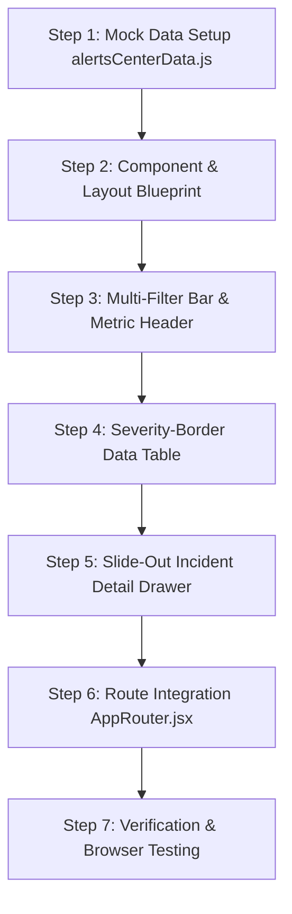

# ALERTS CENTER — MASTER ARCHITECTURAL & DESIGN PLAN

> **Location:** `/alerts-center`  
> **Target Audience:** Incident Commanders, Supply Chain Risk Managers, Quality Assurance Teams, Operations Supervisors.  
> **Design Language:** Enterprise Grade Multi-Filter Telemetry Table with Severity Border Coding, Real-time Batch Actions, and Slide-Out Exception Resolution Drawer.

---

## 1. ARCHITECTURAL OBJECTIVES & CONCEPTUAL VISION

The **Alerts Center** is the centralized incident resolution engine for the LogisticsHub platform. While the *Control Tower* provides spatial map telemetry, the *Alerts Center* provides deep, filterable incident lifecycle management (triage, assignment, root-cause tagging, escalation workflows, and resolution recording).

### Key Architectural Pillars:
1. **Multi-Dimensional Triage Filters**: Filter by Severity (`Critical`, `High`, `Medium`, `Low`), Status (`Unassigned`, `Assigned`, `Investigating`, `Resolved`), Alert Type (`Late Pickup`, `Late Delivery`, `Breakdown`, `Temperature Breach`, `Geofence Exit`), and Time Range.
2. **Batch Action Control Header**: Multi-select bulk actions (Bulk Assign, Bulk Resolve, Bulk Escalate, Export CSV).
3. **Interactive Slide-Out Incident Drawer**: Detailed slide-out sidebar inspecting root cause, related entities (Shipment, Order, Vehicle, Driver), timeline history log, and resolution actions.
4. **Severity Left-Border Data Table**: Clean, scannable table layout with color-coded left borders, relative timestamps, assignee avatars, and inline quick actions.
5. **Real-Time Incident Metric Strip**: Quick top-level counters tracking Total Active Alerts, Critical Breaches, Unassigned Incidents, and Average Time to Resolve (MTTR).

---

## 2. INTERFACE LAYOUT & SPATIAL ARCHITECTURE

The Alerts Center uses a **Split Table + Slide-Out Resolution Workspace**:

```
┌────────────────────────────────────────────────────────────────────────────────────────┐
│ TOP BAR: Alerts Center Header | Search | Multi-Filter Bar | Export | Refresh           │
├────────────────────────────────────────────────────────────────────────────────────────┤
│ METRICS STRIP: Total Alerts (267) | Critical (14) | Unassigned (38) | MTTR (18 mins)    │
├───────────────────────────────────────────────────────────────────┬────────────────────┤
│ MAIN ALERTS TABLE DATA GRID                                       │ SLIDE-OUT DETAIL   │
│ (Multi-select checkboxes | Severity Left Border | Rich Columns)  │ DRAWER (Right 420px│
├──────┬──────────┬───────────────┬───────────┬──────────┬──────────┤                    │
│ [ ]  │ SEVERITY │ ALERT TYPE    │ ENTITY    │ ASSIGNEE │ STATUS   │ • Incident Summary │
├──────┼──────────┼───────────────┼───────────┼──────────┼──────────┤ • Root Cause       │
│ [x]  │ 🔴 Crit  │ Temp Breach   │ SHP-12347 │ Ramesh K │ Inspect  │ • Entity Links     │
│ [ ]  │ 🟠 High  │ Late Delivery │ SHP-12348 │ Unassigned│ Inspect │ • Incident Timeline│
│ [ ]  │ 🟡 Med   │ Geofence Exit │ VEH-0244  │ Manoj V  │ Inspect  │ • Action Buttons   │
└──────┴──────────┴───────────────┴───────────┴──────────┴──────────┴────────────────────┘
```

---

## 3. CORE FUNCTIONALITY & INTERACTION DESIGN

### A. Advanced Multi-Dimensional Triage Filters
- **Search Bar**: Instant filter across Alert ID, Title, Entity ID (Shipment/Order/Vehicle), or Assignee Name.
- **Severity Pill Filters**: `All`, `Critical (14)`, `High (42)`, `Medium (85)`, `Low (126)`.
- **Status Filter Dropdown**: `All Statuses`, `Unassigned`, `Assigned`, `Investigating`, `Resolved`.
- **Alert Type Filter Dropdown**: `All Types`, `Late Pickup`, `Late Delivery`, `Vehicle Breakdown`, `Temperature Breach`, `Geofence Violation`, `Document Expiry`.
- **Date Range Quick Select**: `Today`, `Last 24 Hours`, `This Week`, `Custom Range`.

### B. Rich Data Table Structure & Interactions
- **Left Severity Indicator Border**:
  - 🔴 **Critical**: Red Left Border (`#E74C3C`) + Light Tint Background (`#FFF8F8`)
  - 🟠 **High**: Orange Left Border (`#FF9800`) + Light Tint Background (`#FFFDF5`)
  - 🟡 **Medium**: Yellow Left Border (`#F39C12`) + Soft Yellow Background (`#FFFFF8`)
  - 🔵 **Low**: Blue Left Border (`#3498DB`) + Clean White Background
- **Columns**:
  - `Checkbox`: Bulk selection for batch actions.
  - `Severity & Type`: Icon + Colored Badge + Alert Title.
  - `Description`: Truncated incident summary.
  - `Related Entity`: Clickable Shipment / Order / Vehicle ID badge.
  - `Assignee`: User Avatar + Name (or "Unassigned" button).
  - `Time`: Relative timestamp (`8 mins ago`).
  - `Status`: Colored pill badge (`Investigating`, `Action Required`, `Resolved`).
  - `Actions`: `Inspect Drawer` / `Quick Resolve` button.

### C. Slide-Out Incident Resolution Drawer
- **Trigger**: Clicking any alert row opens the **Right Resolution Drawer (420px width)** with smooth animation.
- **Drawer Sections**:
  1. **Header & Severity Status**: Alert ID, Title, Severity Badge, and Close Button.
  2. **Incident Telemetry Summary**: Created time, last updated, SLA timer countdown.
  3. **Root Cause Analysis**: Reported cause (e.g., *Reefer Compressor Fault*, *NH-48 Traffic Jam*).
  4. **Linked Entity Profiles**: Quick links to Shipment detail, Order detail, Vehicle HUD, and Driver contacts.
  5. **Audit Log & History Timeline**: Chronological log of status changes and owner assignments.
  6. **Resolution Action Footer**:
     - *Reassign Owner* dropdown.
     - *Change Status* dropdown.
     - *Escalate Alert* button.
     - *Mark as Resolved* primary button.

---

## 4. COMPONENT & CODE ARCHITECTURE

### Directory & File Structure
```
src/pages/Home/AlertsCenter/
├── AlertsCenter.jsx               # Main container page component
├── AlertsCenter.css               # Triage table & slide-out drawer styling
├── AlertFilterBar.jsx             # Top multi-dimensional search & filter bar
├── AlertsTable.jsx                # Severity-bordered interactive data table
├── AlertDetailDrawer.jsx          # Right slide-out resolution & audit drawer
└── BatchActionHeader.jsx          # Contextual header bar for bulk actions

src/utils/mockData/
└── alertsCenterData.js            # Mock dataset (25+ realistic operational alerts)
```

---

## 5. MOCK DATA SCHEMA SPECIFICATION (`alertsCenterData.js`)

1. **`alertsMetrics` Object**:
   - `totalAlerts`, `criticalCount`, `highCount`, `unassignedCount`, `resolvedToday`, `avgMTTR`.

2. **`alertsList` Array (25+ entries)**:
   - `id`: e.g., `ALT-9821`
   - `severity`: `'critical' | 'high' | 'medium' | 'low'`
   - `type`: `'Temperature Breach' | 'Late Delivery' | 'Vehicle Breakdown' | 'Geofence Exit' | 'Document Expiry'`
   - `title`: Short summary title
   - `description`: Detailed root cause explanation
   - `entityType`: `'Shipment' | 'Order' | 'Vehicle' | 'Driver'`
   - `entityId`: e.g., `SHP-100247`
   - `assignee`: `{ name: string, avatar: string } | null`
   - `status`: `'Unassigned' | 'Investigating' | 'Action Required' | 'Resolved'`
   - `timestamp`: `'8 mins ago'`
   - `createdDate`: `'2026-09-27 14:32'`
   - `location`: e.g., `'NH-48 Km 114, Rajasthan'`
   - `historyLog`: `[{ time: string, user: string, action: string }]`

---

## 6. STEP-BY-STEP IMPLEMENTATION ROADMAP



1. **Step 1 — Create Mock Data (`alertsCenterData.js`)**:
   - Populate 25+ realistic alerts with telemetry info, entity links, assignees, and audit history.
2. **Step 2 — Create Component & Style Files**:
   - Build `AlertsCenter.jsx`, `AlertsCenter.css`, `AlertFilterBar.jsx`, `AlertsTable.jsx`, `AlertDetailDrawer.jsx`.
3. **Step 3 — Implement Multi-Filter & Metrics Header**:
   - Connect live search, severity pills, status dropdowns, and metrics counters.
4. **Step 4 — Implement Data Table with Severity Styling**:
   - Render table with color-coded left borders, checkboxes, assignee badges, and quick inspect buttons.
5. **Step 5 — Connect Slide-Out Resolution Drawer**:
   - Build slide-out panel with root-cause analysis, entity links, timeline logs, and status update actions.
6. **Step 6 — Update Router & Navigation**:
   - Map route `/alerts-center` in `AppRouter.jsx` and activate Sidebar navigation item.
7. **Step 7 — Browser Verification & Push to GitHub**:
   - Perform subagent verification, take screenshots, commit and push to `main`.
