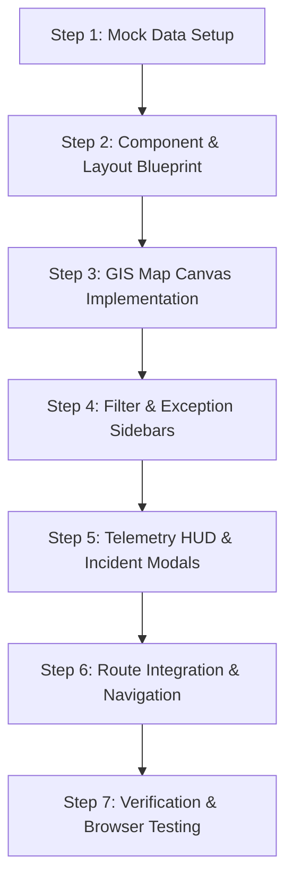

# CONTROL TOWER — MASTER ARCHITECTURAL & DESIGN PLAN

> **Location:** `/control-tower`  
> **Target Audience:** Control Tower Commanders, Dispatch Controllers, Supply Chain Telemetry Operators, Regional Risk Analysts.  
> **Design Language:** Enterprise Modern Dark/Glassmorphic Hybrid with Dynamic Interactive GIS Mapping, Telemetry Data Cards, and Real-Time Exception Streams.

---

## 1. ARCHITECTURAL OBJECTIVES & CONCEPTUAL VISION

The **Control Tower** is the core operational war-room of the LogisticsHub ecosystem. It bridges static logistics planning with dynamic real-time field telemetry (GPS coordinates, vehicle telemetry, geofence breaches, traffic density, and sensor thresholds).

### Key Architectural Pillars:
1. **Interactive Spatial Telemetry Grid**: Full-featured GIS mapping view displaying active fleet vehicles, shipment locations, geofence polygons, and risk heatmaps.
2. **Real-Time Exception Stream**: Live feed of active operational incidents (delays, temperature drops, breakdowns, route deviations) with instant action triggers.
3. **Multi-Perspective View Toggles**: Seamless transition between **GIS Map Mode**, **Live List Telemetry Mode**, and **Grid View**.
4. **Interactive Telemetry Modals & Popups**: Deep inspect drawer and popups for active vehicles, drivers, shipments, and risk queues.
5. **Zero-Jank Visual Momentum**: Smooth canvas markers, reactive filters, and dynamic pulse animations for critical alerts.

---

## 2. INTERFACE LAYOUT & SPATIAL ARCHITECTURE

The Control Tower adopts a **Full-Screen Workspace Blueprint** (maximizing viewport space while maintaining seamless integration with the global `Layout` system):

```
┌────────────────────────────────────────────────────────────────────────────────────────┐
│ TOP BAR: Control Tower Header | Live Telemetry Status: ACTIVE | Refresh: 30s | Filters │
├─────────────────────────┬──────────────────────────────────────────┬───────────────────┤
│ LEFT PANEL: FILTERS     │ CENTER PANEL: MAP / TELEMETRY CANVAS     │ RIGHT PANEL:      │
│ & MAP LAYERS (260px)    │ (Flexible Main View, ~70% screen)        │ ALERT STACK       │
├─────────────────────────┤                                          │ (320px)           │
│ • Status Filters        │ • Interactive GIS Map (Canvas/SVG)       │                   │
│   - On-Time (189)       │ • Vehicle Markers (Color-coded)          │ • Active          │
│   - At Risk (34)        │ • Geofence Overlays (Mumbai, Delhi, etc)  │   Exceptions (23) │
│   - Delayed (22)        │ • Selected Vehicle Telemetry HUD         │ • Severity Filter │
│ • Fleet/Vehicle Types   │ • Zoom, Pan, & Layer Controls            │ • Incident Cards  │
│ • Layers Toggle         │ • Real-time Speed & Traffic Overlay      │   with Actions    │
│   - Vehicles (ON)       │                                          │ • Quick Escalate  │
│   - Geofences (ON)      │                                          │   / Reassign      │
│   - Traffic (OFF)       │                                          │                   │
│   - Heatmap (OFF)       │                                          │                   │
├─────────────────────────┴──────────────────────────────────────────┴───────────────────┤
│ BOTTOM TELEMETRY BAR: Quick Metrics Bar (Total: 245 | On-Time: 189 | At Risk: 34 | Delayed: 22) │
└────────────────────────────────────────────────────────────────────────────────────────┘
```

---

## 3. CORE FUNCTIONALITY & INTERACTION DESIGN

### A. Dynamic GIS Map Canvas & Vehicle Markers
- **Custom Interactive Map Simulation & Integration**: Interactive vector canvas with custom markers representing trucks, vans, trailers, and bikes.
- **Marker Color Coding**:
  - 🟢 **Emerald Green (`#27AE60`)**: On-Time & nominal execution.
  - 🟠 **Amber Orange (`#FF9800`)**: At-Risk (minor traffic delay, approaching geofence buffer).
  - 🔴 **Crimson Red (`#E74C3C`)**: Delayed / Critical Exception (breakdown, speed violation, temp drop).
  - 🔵 **Primary Blue (`#0066CC`)**: Selected / Highlighted Vehicle.
- **Vehicle HUD Drawer / Popup**:
  - Clicking any vehicle pin highlights the marker and opens the **Vehicle Telemetry HUD**:
    - **Vehicle ID & Model**: `VEH-045` (Volvo FH16 540)
    - **Driver Profile**: Name, Phone, Rating, Driving Hours
    - **Live Metrics**: Speed (`68 km/h`), Fuel Level (`74%`), Cargo Temp (`+4.2°C`), Battery (`13.8V`)
    - **Current Route**: Origin → Current Location → Destination
    - **Estimated Delay**: `+42 mins` due to NH-48 congestion
    - **Quick Actions**: *Call Driver*, *Reroute*, *Raise Incident*, *View Shipment*

### B. Filter & Layer Management (Left Sidebar)
- **Status Filter Checkboxes**: Instant multi-select filtering for On-Time, At-Risk, Delayed, and Stationary vehicles.
- **Carrier & Vehicle Type Selector**: Dropdown to filter by specific logistics carriers (e.g., Express Logistics, BlueDart, Spot Carrier) and vehicle classes.
- **GIS Map Layer Toggles**:
  - **Vehicles Toggle**: Show/Hide vehicle position pins.
  - **Shipments Toggle**: Show/Hide cargo destination nodes.
  - **Geofences Toggle**: Show polygon outlines around Major Logistics Hubs (Mumbai WH, Delhi Facility, Bangalore Dock).
  - **Traffic Density Overlay**: Show color-coded highway congestion highlights.
  - **Risk Heatmap**: Density visualizer for delay hotspots.

### C. Live Exception Stream & Incident Control Stack (Right Sidebar)
- **Active Exceptions Queue**: Displays a real-time list of operational anomalies (e.g., *Geofence Exit Delay*, *Temperature Breach*, *Over-speeding*, *Unscheduled Stop*).
- **Severity Classification Tags**: `CRITICAL`, `HIGH`, `MEDIUM`, `LOW`.
- **Interactive Action Triggers**:
  - **Reassign Driver/Carrier**: Instantly open reassignment modal.
  - **Acknowledge Alert**: Mute alert and assign handling owner.
  - **Escalate to Manager**: Send urgent notification to regional ops director.

### D. Bottom Control & Telemetry Bar
- **Fleet Summary Counters**: Live pill indicators for Total Tracked, On-Time, At Risk, and Delayed vehicles.
- **View Switcher Buttons**: Toggle between **Map Canvas View**, **Live Telemetry Table View**, and **Grid View**.
- **Real-Time Polling & Refresh Controls**: Auto-refresh toggle (Live 5s, 30s, 60s, Manual Refresh).

---

## 4. COMPONENT & CODE ARCHITECTURE

### Directory & File Structure
```
src/pages/Home/ControlTower/
├── ControlTower.jsx               # Main container page component
├── ControlTower.css               # Bespoke spatial dark/glassmorphic styling
├── ControlTowerMap.jsx            # Interactive GIS map canvas & marker renderer
├── TelemetryFilterSidebar.jsx     # Left sidebar for layer toggles and search filters
├── ExceptionsStackSidebar.jsx     # Right sidebar for active exception stream
├── VehicleTelemetryHUD.jsx        # Floating HUD card for selected vehicle details
└── IncidentActionModal.jsx        # Modal for resolving/escalating active incidents

src/utils/mockData/
└── controlTowerData.js            # Comprehensive mock data (vehicles, pins, geofences, alerts)
```

---

## 5. MOCK DATA SCHEMA SPECIFICATION (`controlTowerData.js`)

1. **`trackedVehicles` Array**:
   - `id`, `vehicleNumber`, `driverName`, `driverPhone`, `type`, `carrier`, `lat`, `lng`, `speed`, `fuel`, `temp`, `status`, `origin`, `destination`, `eta`, `delayMinutes`, `shipmentId`.

2. **`activeExceptions` Array**:
   - `id`, `type`, `severity`, `title`, `description`, `vehicleId`, `shipmentId`, `timestamp`, `location`, `assignedTo`, `status`.

3. **`geofences` Array**:
   - `id`, `name`, `type`, `coordinates` (polygon/radius), `activeVehiclesCount`, `status`.

4. **`controlTowerStats` Object**:
   - `totalVehicles`, `onTimeCount`, `atRiskCount`, `delayedCount`, `criticalIncidentsCount`, `avgSpeed`.

---

## 6. STEP-BY-STEP IMPLEMENTATION ROADMAP



1. **Step 1 — Create Mock Data Source (`controlTowerData.js`)**:
   - Populate realistic GPS coordinates, vehicle telemetry, active alerts, and geofence nodes.
2. **Step 2 — Create Style & Component Files**:
   - Build `ControlTower.jsx`, `ControlTower.css`, `ControlTowerMap.jsx`, `TelemetryFilterSidebar.jsx`, `ExceptionsStackSidebar.jsx`, `VehicleTelemetryHUD.jsx`.
3. **Step 3 — Implement Interactive GIS Map Canvas**:
   - Render interactive map view with custom SVG vehicle pins, status rings, interactive click handlers, and geofence boundary boxes.
4. **Step 4 — Implement Filter Controls & Exception Queue**:
   - Connect real-time status check filters, carrier filters, search bar, and incident resolution cards.
5. **Step 5 — Connect Telemetry HUD & Resolution Flow**:
   - Ensure clicking vehicle pins reveals detailed metrics, driver stats, and quick actions.
6. **Step 6 — Update Router & Navigation**:
   - Map route `/control-tower` in `AppRouter.jsx` and enable Sidebar highlighting.
7. **Step 7 — Browser QA & Push to GitHub**:
   - Run browser subagent verification, take screenshots, commit and push to `main`.
