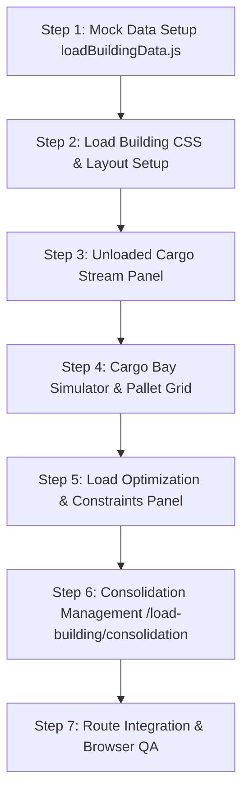

# LOAD BUILDING & CONSOLIDATION MANAGEMENT — MASTER ARCHITECTURAL & DESIGN PLAN

> **Location Routes:**  
> • `/load-building` — Interactive Load Builder Workbench (3-Column Workspace: Unloaded Cargo Stream, 2D/3D Vehicle Load Bay Simulator & Weight Meters, Load Optimizer & Validation Rules)  
> • `/load-building/consolidation` — Consolidation Management Strategies (Tabbed Consolidation Hub: Destination-Based, Carrier-Based, Time-Based, Lane-Based Strategies)  
> **Target Audience:** Load Optimization Engineers, Warehouse Shipping Supervisors, Dispatch Controllers, Carrier Fleet Dispatchers.  
> **Design Language:** Tactical Freight Cargo Workbench with Visual Pallet Grid Simulators, Axle Weight Distribution Gauges, Cost Savings Estimators, and Multi-Strategy Triage Cards.

---

## 1. ARCHITECTURAL OBJECTIVES & CONCEPTUAL VISION

The **Load Building & Consolidation Management** module turns planned shipments into physically packed, weight-balanced, and route-sequenced truckloads. It maximizes cubic volume utilization, ensures axle weight compliance, checks temperature & hazmat compatibility, and executes multi-strategy cargo consolidation (Destination, Carrier, Time-Window, and Lane-Based).

### Key Architectural Pillars:
1. **Interactive 3-Column Load Builder (`/load-building`)**:
   - **Left Panel (25%)**: *Unloaded Cargo Stream* (Shipments ready to load with drag handles, weight/cube badges, SLA flags).
   - **Center Panel (50%)**: *2D Cargo Bay Simulator & Pallet Grid* (Interactive vehicle loading bay rendering box placement, pallet positions, axle weight distribution meters, and vehicle selector dropdown).
   - **Right Panel (25%)**: *Load Optimization & Rule Constraints* (Weight % utilization meter, Volume cube % meter, multi-stop route sequencing, and constraint validation checkers).
2. **Consolidation Management Hub (`/load-building/consolidation`)**:
   - Strategy-driven consolidation workspace featuring 4 dedicated strategy tabs:
     1. **Destination-Based Consolidation** (Group by destination city).
     2. **Carrier-Based Consolidation** (Group by preferred carrier capacity).
     3. **Time-Based Consolidation** (Group by pickup/delivery SLA window).
     4. **Lane-Based Consolidation** (High-frequency corridor grouping).

---

## 2. INTERFACE LAYOUT & SPATIAL ARCHITECTURE

### A. Load Builder Workbench (`/load-building`)
```
┌────────────────────────────────────────────────────────────────────────────────────────┐
│ BREADCRUMB: Home > Load Building > Load Builder                                        │
│ TITLE: Load Builder Workbench | Load ID: LDB-2026-042 | [Auto-Optimize] [Save & Dispatch]│
├────────────────────────────────────────────────────────────────────────────────────────┤
│ METRICS: Payload Fill (84%) | Cube Volume Fill (76%) | Pallets (12/14) | Savings (₹34.5K)│
├──────────────────────────┬─────────────────────────────────┬───────────────────────────┤
│ UNLOADED CARGO (25%)     │ CARGO BAY SIMULATOR (50%)       │ OPTIMIZATION & RULES (25%)│
├──────────────────────────┼─────────────────────────────────┼───────────────────────────┤
│ Search Cargo             │ Vehicle: Heavy Truck (MH-12-1234)│ Load Payload Summary      │
│ Filter: Destination      │ Capacity: 5,000 kg | 20 Cbm     │ • Weight: 4,200 / 5,000 kg│
│                          │                                 │ • Volume: 15.2 / 20 Cbm   │
│ [::] SHP-100245          │ ┌─────────────────────────────┐ │ • Pallet Fill: 12 / 14    │
│   • Mumbai → Delhi       │ │ PALLET 1 | PALLET 2 | PAL... │ │                           │
│   • 840 kg | 4.2 Cbm     │ │ [Box 101] [Box 102] [Box 103]│ │ Constraint Validation:    │
│                          │ └─────────────────────────────┘ │  Axle Weight Distribution  │
│ [::] SHP-100246          │                                 │  Hazmat Compatibility     │
│   • Pune → Bangalore     │ Axle Weight Meter:              │  Temp Zone Compliance     │
│   • 1,200 kg | 6.5 Cbm   │ Front: 42% | Rear: 58% (OK)    │                           │
└──────────────────────────┴─────────────────────────────────┴───────────────────────────┘
```

### B. Consolidation Management (`/load-building/consolidation`)
```
┌────────────────────────────────────────────────────────────────────────────────────────┐
│ TITLE: Consolidation Management | Active Strategies | Total Cost Savings: ₹1,84,000    │
├────────────────────────────────────────────────────────────────────────────────────────┤
│ STRATEGY TABS: [Destination-Based] [Carrier-Based] [Time-Window] [Lane Corridor]        │
├────────────────────────────────────────────────────────────────────────────────────────┤
│ CONSOLIDATION OPPORTUNITIES TABLE                                                      │
│ DESTINATION   WAITING SHIPMENTS   TOTAL WEIGHT   TOTAL CUBE   ESTIMATED SAVINGS  ACTION    │
│ ────────────────────────────────────────────────────────────────────────────────────── │
│ Delhi Hub     4 LTL Cargoes       2,250 kg       12.8 Cbm     ₹42,500 (34%)      Consolidate│
│ Bangalore     3 LTL Cargoes       1,840 kg       9.4 Cbm      ₹31,200 (28%)      Consolidate│
│ Jaipur Park   5 LTL Cargoes       3,100 kg       16.2 Cbm     ₹54,000 (38%)      Consolidate│
└────────────────────────────────────────────────────────────────────────────────────────┘
```

---

## 3. CORE FUNCTIONALITY & COMPONENT SPECIFICATION

### 1. Load Builder (`/load-building`)
- **Metric Header**: Payload Weight Fill (`84%`), Cube Volume Fill (`76%`), Pallet Count (`12/14`), Estimated Cost Savings (`₹34,500`).
- **Left Panel (Unloaded Cargo Stream)**: List of shipments ready to load with weight/volume tags, hazmat indicators, cold-chain temp requirements, and drag handle icons.
- **Center Panel (Cargo Bay Simulator)**:
  - Vehicle Selector dropdown (Heavy 20ft Truck, Multi-Axle Trailer, Medium Van).
  - Visual 2D Pallet Grid rendering loaded boxes color-coded by destination stop.
  - Axle Weight Balance Gauge (Front axle % vs Rear axle % balance checker).
- **Right Panel (Optimization & Rule Constraints)**:
  - Weight & volume capacity progress meters.
  - Multi-stop drop sequencing (Stop 1: Delhi, Stop 2: Jaipur).
  - Validation Checkers (Axle distribution OK, Hazmat grouping OK, Temp zone OK).

### 2. Consolidation Management (`/load-building/consolidation`)
- **Strategy Tabs**: Switch between Destination-Based, Carrier-Based, Time-Window, and Lane Corridor consolidation algorithms.
- **Consolidation Opportunity Cards & Table**: Displays waiting LTL cargo count, total aggregated weight/volume, projected cost savings (₹), and one-click `"Execute Consolidation"` buttons.

---

## 4. COMPONENT & CODE ARCHITECTURE

### Directory & File Structure
```
src/pages/LoadBuilding/
├── LoadBuilder.jsx               # Main 3-column load builder workbench (/load-building)
├── ConsolidationManagement.jsx   # Consolidation strategy workspace (/load-building/consolidation)
├── UnloadedCargoPanel.jsx        # Left panel: Cargo ready to load
├── CargoBaySimulator.jsx         # Center panel: 2D Pallet grid & vehicle simulator
├── LoadOptimizationPanel.jsx     # Right panel: Optimization meters & constraint checks
└── LoadBuilding.css              # Unified styling for load building module

src/utils/mockData/
└── loadBuildingData.js           # Complete mock dataset (ready cargo, vehicles, consolidation opportunities)
```

---

## 5. MOCK DATA SCHEMA SPECIFICATION (`loadBuildingData.js`)

1. **`loadBuilderStats` Object**:
   - `totalReadyItems`, `totalWeightKg`, `totalVolumeCbm`, `weightUtilPct`, `volumeUtilPct`, `palletCount`, `estimatedSavings`.

2. **`readyCargoList` Array (8+ entries)**:
   - `id`, `shipmentId`, `destination`, `weightKg`, `volumeCbm`, `serviceLevel`, `hazmat`, `tempRequired`, `boxesCount`.

3. **`availableVehicles` Array**:
   - `id`, `vehicleNumber`, `type`, `maxWeightKg`, `maxVolumeCbm`, `maxPallets`, `lengthFt`, `hazmatCertified`, `tempControlled`.

4. **`consolidationOpportunities` Object**:
   - `destinationBased`, `carrierBased`, `timeBased`, `laneBased` arrays detailing shipment counts, aggregated weights, and projected savings (₹).

---

## 6. STEP-BY-STEP IMPLEMENTATION ROADMAP



1. **Step 1 — Create Mock Data (`loadBuildingData.js`)**:
   - Define ready cargo items, vehicle specs, pallet configurations, and consolidation strategy tables.
2. **Step 2 — Create Style & Component Files**:
   - Build `LoadBuilding.css`, `LoadBuilder.jsx`, `UnloadedCargoPanel.jsx`, `CargoBaySimulator.jsx`, `LoadOptimizationPanel.jsx`, `ConsolidationManagement.jsx`.
3. **Step 3 — Build Load Builder Workbench (`/load-building`)**:
   - 3-column workspace connecting cargo list, pallet grid simulator, and rule constraints.
4. **Step 4 — Build Consolidation Management (`/load-building/consolidation`)**:
   - Strategy tabs (Destination, Carrier, Time, Lane) with opportunity tables and execution buttons.
5. **Step 5 — Router Integration (`AppRouter.jsx`)**:
   - Map routes `/load-building` and `/load-building/consolidation`.
6. **Step 6 — Browser Verification & Push to GitHub**:
   - Perform subagent verification, take screenshots, commit and push to `main`.
