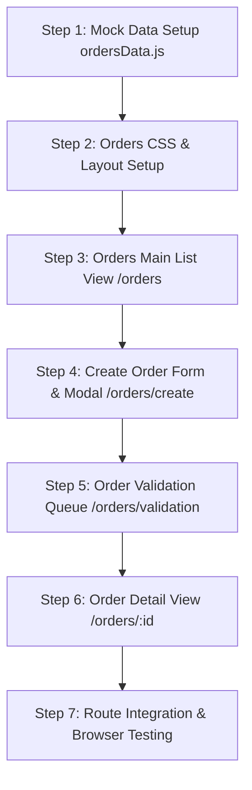

# ORDERS MANAGEMENT — MASTER ARCHITECTURAL & DESIGN PLAN

> **Location Routes:**  
> • `/orders` — Orders Main List View (Data Grid & Filters)  
> • `/orders/create` — Create / Edit Order Form Workflow  
> • `/orders/validation` — Order Validation Queue & Resolution  
> • `/orders/:id` — Order Deep Inspection Detail View (Tabs: Overview, Items, Timeline, Documents, Costs)  
> **Target Audience:** Order Managers, Dispatch Planners, Customer Service Reps, Logistics Coordinators.  
> **Design Language:** Enterprise Modern Standard with Color-Coded Status Badges, Batch Controls, Modal Forms, and Detailed Execution Tabs.

---

## 1. ARCHITECTURAL OBJECTIVES & CONCEPTUAL VISION

The **Orders Management** section is the primary entry point for cargo demand in the LogisticsHub ecosystem. It handles order ingestion, validation checks, status lifecycle tracking (`Draft`, `Pending Validation`, `Validated`, `Planned`, `Assigned`, `Dispatched`, `Delivered`, `Cancelled`), and order-to-shipment planning.

### Key Architectural Pillars:
1. **Multi-Route Workspace Navigation**: Seamless navigation between Orders List, Create Order Form/Modal, Validation Queue, and Deep Order Details.
2. **Comprehensive Triage Filters**: Filter by Status, Date Range, Priority (`Normal`, `High`, `Urgent`), Customer, and City Origin/Destination.
3. **Interactive Order Creator Modal & Page (`/orders/create`)**: Multi-section form collecting Order Header, Items Table (SKU, Qty, Weight, Volume, Hazmat, Temp Controls), Origin Pickup, and Destination Delivery details.
4. **Validation Queue Processor (`/orders/validation`)**: Triage cards highlighting missing addresses, weight overflow, and contact errors with one-click fix popups.
5. **Order Detail Inspector (`/orders/:id`)**: Rich tabbed layout displaying Order Info, Items Breakdown, Linked Shipments, Audit History, and Document Uploads.

---

## 2. INTERFACE LAYOUT & SPATIAL ARCHITECTURE

### A. Main Orders List View (`/orders`)
```
┌────────────────────────────────────────────────────────────────────────────────────────┐
│ BREADCRUMB: Home > Orders > All Orders                                                 │
│ PAGE TITLE: Orders Management (2,847) | [+ Create Order] [Import Orders] [Export CSV] │
├────────────────────────────────────────────────────────────────────────────────────────┤
│ FILTER BAR: Search | Status Filter | Priority Filter | Customer Dropdown | Date Range   │
├────────────────────────────────────────────────────────────────────────────────────────┤
│ ORDERS DATA TABLE GRID                                                                 │
│ [x] ORDER ID     CUSTOMER         ORIGIN → DEST     ITEMS   WEIGHT    PRIORITY STATUS  │
│ ────────────────────────────────────────────────────────────────────────────────────── │
│ [ ] ORD-2024-891 ABC Logistics   Mumbai → Delhi    12 psc  840 kg    🔴 High  Planned │
│ [ ] ORD-2024-892 Tata Steel      Pune → Bangalore  5 psc   320 kg    🟡 Med   Pending │
│ [ ] ORD-2024-893 Reliance Retail Delhi → Chennai   22 psc  1.2 T     🔴 High  Val-Err │
└────────────────────────────────────────────────────────────────────────────────────────┘
```

### B. Order Detail View (`/orders/:id`)
```
┌────────────────────────────────────────────────────────────────────────────────────────┐
│ HEADER: Order ORD-2024-891 [Planned Badge] | [Edit Order] [Create Shipment] [Cancel]   │
├────────────────────────────────────────────────────────────────────────────────────────┤
│ TABS: [Overview] [Shipments (2)] [Timeline] [Documents (3)] [Costs] [Audit Log]       │
├──────────────────────────────────────────┬─────────────────────────────────────────────┤
│ LEFT PANEL (60%):                        │ RIGHT PANEL (40%):                          │
│ • Order Header & Service Level           │ • Recommended Action Card                   │
│ • Origin & Destination Details           │ • Quick Actions (Split Order, On Hold)      │
│ • Items Breakdown Table                  │ • Linked Shipments List (SHP-100245)        │
└──────────────────────────────────────────┴─────────────────────────────────────────────┘
```

---

## 3. CORE FUNCTIONALITY & COMPONENT SPECIFICATION

### 1. Main List View (`/orders`)
- **Metric Header Strip**: Total Orders (`2,847`), Pending Validation (`89`), Validated & Planned (`1,420`), In Transit (`986`).
- **Batch Action Controls**: Select multiple rows to Bulk Update Status, Set Priority, or Export Orders.
- **Table Columns**: Checkbox, Order ID link, Customer Name, Route (Origin → Destination), Cargo Items & Weight, Service Level (`Standard`, `Express`, `Same-Day`), Priority Icon, Status Badge, Expected Delivery, Actions.

### 2. Create Order Builder (`/orders/create`)
- **Order Header**: Customer picker, Priority (`Normal`, `High`, `Urgent`), Service Level.
- **Cargo Items Table**: Add/Remove SKU rows with auto-calculated Total Weight, Total Volume, Hazmat toggle, and Temperature Range (`Min °C` to `Max °C`).
- **Pickup & Delivery Addresses**: Location lookup, Address line, Scheduled Date/Time, Dock/Gate Number, Contact Person & Phone.

### 3. Order Validation Queue (`/orders/validation`)
- **Queue Cards**: Error cards flagged as `Critical Error` (red), `Warning` (orange), or `Passed` (green).
- **Validation Fix Modal**: Inline input correction for missing PIN codes, phone number formatting, or vehicle weight capacity breaches.

### 4. Order Detail View (`/orders/:id`)
- **Tab 1: Overview**: Order metadata, Origin/Destination cards, Cargo items grid, and Quick Action sidebar.
- **Tab 2: Shipments**: List of shipments created from this order.
- **Tab 3: Timeline**: Vertical event timeline (Order Placed → Validated → Planned → Picked Up → Delivered).
- **Tab 4: Documents**: Upload & view POs, Invoices, Packing Slips, and E-Way Bills.
- **Tab 5: Audit Log**: Chronological record of user mutations.

---

## 4. COMPONENT & CODE ARCHITECTURE

### Directory & File Structure
```
src/pages/Orders/
├── OrdersList.jsx                # Main /orders data grid & filter page
├── CreateOrderModal.jsx          # Order creation modal & /orders/create page
├── OrderValidation.jsx           # Order validation queue (/orders/validation)
├── OrderDetail.jsx               # Order detail view (/orders/:id)
└── Orders.css                    # Unified styling for orders module

src/utils/mockData/
└── ordersData.js                 # Complete mock dataset (orders list, validation errors, timeline logs)
```

---

## 5. MOCK DATA SCHEMA SPECIFICATION (`ordersData.js`)

1. **`ordersStats` Object**:
   - `totalOrders`, `pendingValidation`, `plannedCount`, `inTransitCount`, `deliveredCount`.

2. **`ordersList` Array (20+ entries)**:
   - `id`: e.g. `ORD-2024-0891`
   - `customer`: Customer name & code
   - `origin`: `{ city, address, pickupTime, contact, phone }`
   - `destination`: `{ city, address, deliveryTime, contact, phone }`
   - `items`: `[{ sku, description, qty, unit, weightKg, volumeCbm, hazmat, tempRange }]`
   - `totalWeight`: e.g. `840 kg`
   - `totalVolume`: e.g. `4.2 Cbm`
   - `priority`: `'normal' | 'high' | 'urgent'`
   - `serviceLevel`: `'Standard' | 'Express' | 'Same-Day'`
   - `status`: `'Draft' | 'Pending Validation' | 'Validated' | 'Planned' | 'Assigned' | 'Dispatched' | 'Delivered' | 'Cancelled'`
   - `createdDate`: `'27-Sep-2026 09:00'`
   - `expectedDelivery`: `'28-Sep-2026 18:00'`
   - `relatedShipmentId`: `SHP-100245`

3. **`validationQueue` Array**:
   - `orderId`, `customer`, `severity`, `errorsCount`, `errorList: [{ field, message, fixType }]`, `timestamp`.

---

## 6. STEP-BY-STEP IMPLEMENTATION ROADMAP



1. **Step 1 — Create Mock Data (`ordersData.js`)**:
   - Populate orders list, validation queue, item breakdowns, and timeline event logs.
2. **Step 2 — Create Style & Component Structure**:
   - Build `Orders.css`, `OrdersList.jsx`, `CreateOrderModal.jsx`, `OrderValidation.jsx`, `OrderDetail.jsx`.
3. **Step 3 — Build Main Orders List View (`/orders`)**:
   - Data table grid with status badges, priority markers, search/filters, and bulk actions.
4. **Step 4 — Build Create Order Builder (`/orders/create`)**:
   - Form inputs for customer info, item SKU table, address pickers, and hazmat options.
5. **Step 5 — Build Order Validation Queue (`/orders/validation`)**:
   - Error queue cards and resolution modal for fixing invalid inputs.
6. **Step 6 — Build Order Detail View (`/orders/:id`)**:
   - Detailed tabbed interface (Overview, Shipments, Timeline, Documents, Costs).
7. **Step 7 — Router Integration & Push to GitHub**:
   - Update `AppRouter.jsx`, verify in browser, commit and push to `main`.
