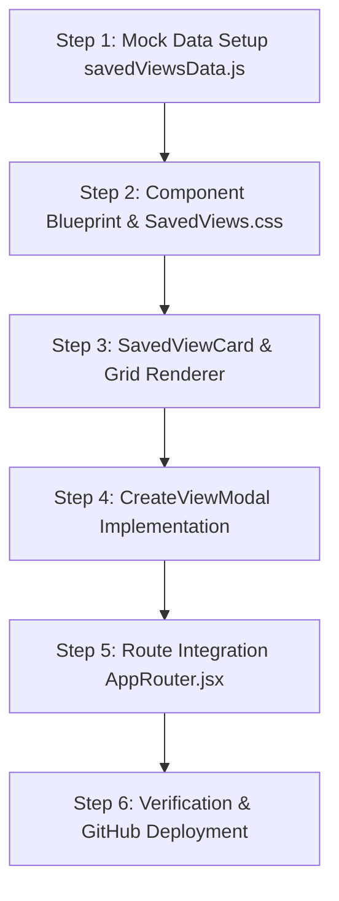

# SAVED VIEWS — MASTER ARCHITECTURAL & DESIGN PLAN

> **Location:** `/saved-views`  
> **Target Audience:** Executive Operations Directors, Hub Dispatchers, Transport Managers, Regional Supervisors.  
> **Design Language:** Enterprise Modern Grid Layout with Preview Cards, Preset Filter Library, Share Controls, and Interactive Custom View Builder Modal.

---

## 1. ARCHITECTURAL OBJECTIVES & CONCEPTUAL VISION

The **Saved Views** module is the personalized dashboard workspace for the LogisticsHub platform. Operators, dispatchers, and executives can create, save, share, and launch customized dashboard configurations (widget selections, filter presets, refresh rates, and role permissions).

### Key Architectural Pillars:
1. **Curated Preset Library & Custom Saved Views**: Default system views (e.g. *Morning Ops Briefing*, *Executive Summary*, *Night Shift Monitor*, *Carrier SLA Tracking*) and user-created custom views.
2. **Interactive View Cards Grid**: 3-column responsive card grid displaying preview thumbnails, metadata, owner badges, shared status, and quick action menus.
3. **Custom View Builder Modal**: Interactive modal allowing users to construct new custom views by selecting widgets, layout grids, default filters, and sharing permissions.
4. **Instant View Switcher & Launching**: One-click navigation to apply preset widget layouts and filters.

---

## 2. INTERFACE LAYOUT & SPATIAL ARCHITECTURE

The Saved Views module uses a **Header Control + 3-Column Workspace Grid Layout**:

```
┌────────────────────────────────────────────────────────────────────────────────────────┐
│ TOP BAR: Saved Views Header | Search Views | Category Pills | + Create Custom View Button│
├────────────────────────────────────────────────────────────────────────────────────────┤
│ METRICS BAR: Total Views (12) | System Presets (5) | My Custom Views (7) | Shared (4)  │
├────────────────────────────────────────────────────────────────────────────────────────┤
│ SAVED VIEWS CARD GRID (3 Columns)                                                      │
│ ┌────────────────────────┐ ┌────────────────────────┐ ┌────────────────────────┐ │
│ │ MORNING OPS BRIEFING   │ │ EXECUTIVE SUMMARY      │ │ NIGHT SHIFT MONITOR    │ │
│ │ • Daily AM Standup     │ │ • Financial & Spend    │ │ • Unattended Telemetry │ │
│ │ • Owner: Transport Mgr │ │ • Owner: VP Supply     │ │ • Owner: Security Team │ │
│ │ • [Launch View] [...]  │ │ • [Launch View] [...]  │ │ • [Launch View] [...]  │ │
│ └────────────────────────┘ └────────────────────────┘ └────────────────────────┘ │
└────────────────────────────────────────────────────────────────────────────────────────┘
```

---

## 3. CORE FUNCTIONALITY & INTERACTION DESIGN

### A. View Category Tabs & Search Filter
- **Category Filter Pills**: `All Views (12)`, `System Presets (5)`, `My Custom Views (4)`, `Shared With Me (3)`.
- **Search Bar**: Real-time filtering by view title, description, or owner name.

### B. Interactive Saved View Cards
Each view card includes:
- **Visual Header / Icon Badge**: Color-coded icon header reflecting the view category.
- **Title & Description**: Detailed summary of the operational focus.
- **Metadata Badges**: Owner name, last modified date, auto-refresh frequency.
- **Share Badges**: Indicators showing whether the view is Private or Shared with team members.
- **Quick Action Triggers**:
  - `Launch View` primary button (navigates directly to configured dashboard).
  - `Action Menu (...)`: *Edit*, *Duplicate*, *Share*, *Delete*.

### C. Custom View Builder Modal (`CreateViewModal.jsx`)
- **Title & Description Input Fields**.
- **Widget Selector Checkboxes**: Choose widgets to include (KPI Cards, Freight Spend Chart, Fleet Capacity, Exception Stack, GIS Map, Dock Schedule).
- **Auto-Refresh Rate Selector**: `Real-time (5s)`, `Every 30s`, `Every 5m`, `Manual`.
- **Sharing & Permission Controls**: `Private (Only Me)`, `Team (Operations)`, `Organization Wide`.

---

## 4. COMPONENT & CODE ARCHITECTURE

### Directory & File Structure
```
src/pages/Home/SavedViews/
├── SavedViews.jsx                # Main container page component
├── SavedViews.css                # Card grid, modal & tag styling
├── SavedViewCard.jsx             # Individual view card component
└── CreateViewModal.jsx           # Custom view creation & editor modal

src/utils/mockData/
└── savedViewsData.js             # Mock dataset of system and custom saved views
```

---

## 5. MOCK DATA SCHEMA SPECIFICATION (`savedViewsData.js`)

1. **`savedViewsList` Array**:
   - `id`, `title`, `description`, `category` (`preset` | `custom` | `shared`), `owner`, `lastModified`, `refreshRate`, `widgetsCount`, `sharedUsersCount`, `icon`, `color`, `targetPath`.

2. **`availableWidgets` Array**:
   - `id`, `name`, `category`, `description`.

---

## 6. STEP-BY-STEP IMPLEMENTATION ROADMAP



1. **Step 1 — Create Mock Data (`savedViewsData.js`)**:
   - Define system preset views and custom user views.
2. **Step 2 — Create Style & Component Files**:
   - Build `SavedViews.jsx`, `SavedViews.css`, `SavedViewCard.jsx`, `CreateViewModal.jsx`.
3. **Step 3 — Build Interactive View Cards & Filters**:
   - Implement category filter pills, search input, and card grid layout.
4. **Step 4 — Build Custom View Builder Modal**:
   - Form inputs for view title, description, widget selection, and permissions.
5. **Step 5 — Route Integration & Navigation**:
   - Map route `/saved-views` in `AppRouter.jsx`.
6. **Step 6 — Browser QA & Push to GitHub**:
   - Perform subagent verification, take screenshots, commit and push to `main`.
