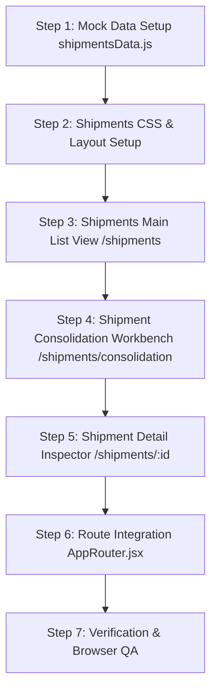

# SHIPMENTS MANAGEMENT — MASTER ARCHITECTURAL & DESIGN PLAN

> **Location Routes:**  
> • `/shipments` — Shipments Main List View (Grid/Table, Status Badges, GPS Live Pins, Multi-View Switcher)  
> • `/shipments/consolidation` — Shipment Consolidation Workbench (Drag-Drop/Multi-Select LTL Cargo Consolidation Engine)  
> • `/shipments/:id` — Shipment Detail View (Tabs: Overview, Route & Legs, Tracking Map & Audit, Documents, Costs, Exceptions)  
> **Target Audience:** Freight Controllers, Carrier Operations Managers, Dispatch Logistics Officers, Tracking Analysts.  
> **Design Language:** Enterprise Freight Command with Live GPS Telemetry Tags, Vehicle Assignment Drawers, Cost Savings Calculators, and Multi-Leg Execution Tabs.

---

## 1. ARCHITECTURAL OBJECTIVES & CONCEPTUAL VISION

The **Shipments Management** section governs active cargo execution across the LogisticsHub ecosystem. It converts validated transportation orders into active freight shipments (`SHP-XXXXXX`), handles LTL cargo consolidation to optimize truckload capacity, tracks multi-leg routing, and manages real-time carrier dispatch operations.

### Key Architectural Pillars:
1. **Multi-View Freight Telemetry Grid (`/shipments`)**: Triage table displaying Shipment ID, Linked Order ID, Origin → Destination, Carrier & Driver Details, Live GPS Location Pin, ETA, and Weight/Volume metrics. Switch between **Table View**, **Map Canvas View**, and **Timeline View**.
2. **Shipment Consolidation Workbench (`/shipments/consolidation`)**: Interactive cargo consolidation engine enabling planners to merge multiple LTL (Less-than-Truckload) shipments heading to common destinations into a single Full-Truckload (FTL) shipment—calculating weight/cube utilization and estimated cost savings.
3. **Deep Shipment Inspector (`/shipments/:id`)**: Rich multi-tabbed layout displaying Overview, Route & Multi-Leg Breakdown, Live GPS Tracking Canvas, Attached Documents, Freight Cost Allocations, and Exception Logs.

---

## 2. INTERFACE LAYOUT & SPATIAL ARCHITECTURE

### A. Main Shipments List View (`/shipments`)
```
┌────────────────────────────────────────────────────────────────────────────────────────┐
│ BREADCRUMB: Home > Shipments > All Shipments                                           │
│ TITLE: Shipments Management (5,234) | [Views: Table | Map | Timeline] | [+ Consolidate]│
├────────────────────────────────────────────────────────────────────────────────────────┤
│ METRICS: Active Freight (5,234) | In Transit (2,840) | At Risk (142) | Delivered (1,980)  │
├────────────────────────────────────────────────────────────────────────────────────────┤
│ FILTER BAR: Search | Status Filter | Carrier Selector | Region Origin/Dest | Date Range │
├────────────────────────────────────────────────────────────────────────────────────────┤
│ SHIPMENTS DATA TABLE                                                                   │
│ [x] SHIPMENT ID  ORDER ID   CUSTOMER      ROUTE (ORIGIN → DEST)  CARRIER   GPS LOCATION │
│ ────────────────────────────────────────────────────────────────────────────────────── │
│ [ ] SHP-100245   ORD-0891   ABC Logist   Mumbai → Pune          Express   NH-48 Km 42  │
│ [ ] SHP-100246   ORD-0892   Tata Steel   Pune → Bangalore       BlueDart  Lonavala Toll│
│ [ ] SHP-100247   ORD-0893   Reliance     Delhi → Jaipur         Spot Carr NH-48 Border │
└────────────────────────────────────────────────────────────────────────────────────────┘
```

### B. Shipment Consolidation Workbench (`/shipments/consolidation`)
```
┌────────────────────────────────────────────────────────────────────────────────────────┐
│ TITLE: Cargo Consolidation Workbench | Target Hub: Mumbai → Delhi | [Consolidate Selected]│
├──────────────────────────────────────────┬─────────────────────────────────────────────┤
│ AVAILABLE LTL CARGO SHIPMENTS (50% Screen)│ CONSOLIDATED SHIPMENT PREVIEW (50% Screen) │
│ • Checkboxes to select candidate LTL cargo│ • Auto-Generated Consolidated Shipment ID   │
│ • [ ] SHP-100252 (Mumbai → Delhi | 340kg)│   (e.g., CON-SHP-2026-009)                  │
│ • [ ] SHP-100253 (Mumbai → Delhi | 480kg)│ • Consolidated Freight Specs:               │
│ • [ ] SHP-100254 (Mumbai → Delhi | 620kg)│   - Total Weight: 1.44 T (72% Truck Fill)   │
│                                          │   - Total Volume: 8.6 Cbm (86% Cube Fill)   │
│                                          │ • Estimated Cost Savings: ₹42,500 (34% ROI) │
│                                          │ • Carrier Selection & Dispatch Schedule     │
└──────────────────────────────────────────┴─────────────────────────────────────────────┘
```

---

## 3. CORE FUNCTIONALITY & COMPONENT SPECIFICATION

### 1. Shipments Main List (`/shipments`)
- **Metric Header**: Total Active Shipments (`5,234`), In Transit (`2,840`), At Risk (`142`), Delivered (`1,980`).
- **View Mode Switcher**:
  - **Table Grid View** (default)
  - **Map Canvas View** (plots active shipments on GIS canvas)
  - **Timeline View** (chronological delivery schedule)
- **Table Columns**: Checkbox, Shipment ID link, Order ID link, Customer Name, Route (Origin → Destination), Carrier & Driver, Current GPS Location, ETA, Weight & Volume, Status Badge, Action Trigger.

### 2. Shipment Consolidation Workbench (`/shipments/consolidation`)
- **Origin/Destination Hub Selectors**: Filter candidate shipments traveling along identical transit corridors.
- **Available Shipments Panel**: Candidate LTL shipments with weight, volume, and service SLA indicators.
- **Consolidation Preview Engine**:
  - Live calculation of **Truck Payload Utilization %** (Target: 70–95%).
  - Live calculation of **Cube Volume Utilization %**.
  - **Cost Savings Estimator**: Calculates savings vs running separate LTL dispatches.
  - Carrier selection and departure date scheduling controls.

### 3. Shipment Detail Inspector (`/shipments/:id`)
- **Tab 1: Overview**: Shipment Header, Freight Details, Pickup/Delivery Cards, Carrier & Vehicle Details, Visual Progress Timeline (`Planned → Confirmed → Assigned → Pickup → In Transit → Delivery → Delivered`).
- **Tab 2: Route & Legs**: Multi-leg route breakdown (Leg 1: Origin → Hub A, Leg 2: Hub A → Destination).
- **Tab 3: Live Tracking**: GPS map canvas showing live vehicle coordinates, route corridor, and vertical tracking event log.
- **Tab 4: Documents**: Upload & inspect Bills of Lading (BOL), Proof of Delivery (POD), Invoices, and Gate Passes.
- **Tab 5: Costs**: Freight base rate, fuel surcharges, toll charges, detention fees, and profit margin summary.

---

## 4. COMPONENT & CODE ARCHITECTURE

### Directory & File Structure
```
src/pages/Shipments/
├── ShipmentsList.jsx             # Main /shipments data grid & multi-view switcher
├── ShipmentConsolidation.jsx     # Cargo consolidation workbench (/shipments/consolidation)
├── ShipmentDetail.jsx            # Deep shipment inspection page (/shipments/:id)
└── Shipments.css                 # Unified styling for shipments module

src/utils/mockData/
└── shipmentsData.js              # Complete mock dataset (shipments list, LTL candidate queue, tracking logs)
```

---

## 5. MOCK DATA SCHEMA SPECIFICATION (`shipmentsData.js`)

1. **`shipmentsStats` Object**:
   - `totalShipments`, `inTransitCount`, `atRiskCount`, `deliveredCount`, `consolidationCandidatesCount`.

2. **`shipmentsList` Array (20+ entries)**:
   - `id`: e.g. `SHP-100245`
   - `orderId`: `ORD-2024-0891`
   - `customer`: Customer name
   - `origin`: `{ city, address, pickupTime, contact }`
   - `destination`: `{ city, address, deliveryTime, contact }`
   - `carrier`: Carrier name & driver info
   - `vehicleNumber`: Vehicle registration
   - `gpsLocation`: Current address & coordinates
   - `weight`: `840 kg`
   - `volume`: `4.2 Cbm`
   - `status`: `'Planned' | 'Confirmed' | 'Assigned' | 'In Transit' | 'At Risk' | 'Delivered' | 'Cancelled'`
   - `eta`: `'28-Sep-2026 14:00'`
   - `progressPct`: 72

3. **`consolidationCandidates` Array**:
   - Candidate LTL shipments eligible for merging into single FTL dispatches.

---

## 6. STEP-BY-STEP IMPLEMENTATION ROADMAP



1. **Step 1 — Create Mock Data (`shipmentsData.js`)**:
   - Populate shipments list, candidate LTL queue, route legs, and tracking logs.
2. **Step 2 — Create Style & Component Structure**:
   - Build `Shipments.css`, `ShipmentsList.jsx`, `ShipmentConsolidation.jsx`, `ShipmentDetail.jsx`.
3. **Step 3 — Build Main Shipments List View (`/shipments`)**:
   - Multi-view switcher (Table, Map, Timeline), status badges, GPS pins, search/filters.
4. **Step 4 — Build Shipment Consolidation Workbench (`/shipments/consolidation`)**:
   - Candidate selection list, utilization meters, cost savings calculator, and FTL creation form.
5. **Step 5 — Build Shipment Detail Inspector (`/shipments/:id`)**:
   - Tabbed layout (Overview, Route & Legs, Tracking Map, Documents, Costs).
6. **Step 6 — Update Router Navigation (`AppRouter.jsx`)**:
   - Map routes `/shipments`, `/shipments/consolidation`, `/shipments/:id`.
7. **Step 7 — Browser Verification & Push to GitHub**:
   - Perform subagent verification, take screenshots, commit and push to `main`.
