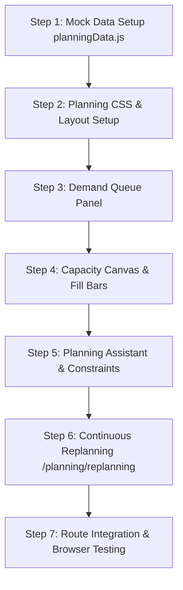

# TRANSPORTATION PLANNING — MASTER ARCHITECTURAL & DESIGN PLAN

> **Location Routes:**  
> • `/planning` — Planning Workbench (3-Column Workspace: Demand Queue, Carrier Capacity Canvas, Planning Assistant)  
> • `/planning/replanning` — Continuous Replanning Engine (Automated Replan Triggers, Disruption Recovery Queue & History Log)  
> **Target Audience:** Transportation Planners, Load Optimization Engineers, Dispatch Strategy Leads, Logistics Operations Directors.  
> **Design Language:** Enterprise Intelligent Command Canvas with Dynamic Capacity Utilization Meters, AI Optimization Assistant, Constraint Checkers, and Continuous Replan Triggers.

---

## 1. ARCHITECTURAL OBJECTIVES & CONCEPTUAL VISION

The **Transportation Planning** module is the strategic decision engine of the LogisticsHub ecosystem. It takes unassigned order demand, matches it against available carrier vehicle capacity, checks physical & SLA constraints (weight, volume, temperature, hazmat, delivery windows), calculates optimal freight costs, and generates execution plans for dispatch.

### Key Architectural Pillars:
1. **3-Column Planning Workbench (`/planning`)**:
   - **Left Panel (30%)**: *Unallocated Demand Queue* (Awaiting planning shipments with drag handles).
   - **Center Panel (40%)**: *Capacity Planning Canvas* (Carrier vehicle load fill bars, multi-version tabs, and view mode switcher: Capacity, Calendar, Lane, GIS Map).
   - **Right Panel (30%)**: *Planning Assistant & Constraint Validator* (Ranked carrier recommendations, constraint checks, and cost optimization estimators).
2. **Continuous Replanning Engine (`/planning/replanning`)**:
   - Automated event-driven replanning workspace responding to real-world operational disruptions (vehicle breakdowns, carrier tender rejections, severe ETA delays, weather blockades).

---

## 2. INTERFACE LAYOUT & SPATIAL ARCHITECTURE

### A. Planning Workbench (`/planning`)
```
┌────────────────────────────────────────────────────────────────────────────────────────┐
│ BREADCRUMB: Home > Planning > Workbench                                                │
│ TITLE: Transportation Planning Workbench | [Auto-Plan AI] [What-If] [Publish Plan]    │
├────────────────────────────────────────────────────────────────────────────────────────┤
│ METRICS: Demand Awaiting (12) | Capacity Fill (73.5%) | Plan Cost ($2,445) | Backhauls (3)│
├──────────────────────────┬─────────────────────────────────┬───────────────────────────┤
│ DEMAND QUEUE (30%)       │ CAPACITY PLAN CANVAS (40%)      │ PLANNING ASSISTANT (30%)  │
├──────────────────────────┼─────────────────────────────────┼───────────────────────────┤
│ Search Demand            │ Tabs: [Current Plan] [Draft v2] │ Suggested AI Recommendations│
│ Filter: Pickup Date      │ View: Capacity | Lane | Map     │ • Assign to Express Log   │
│                          │                                 │ • Consolidate 3 LTL Loads │
│ [::] ORD-2024-891        │ Carrier Capacity Fill Bars:     │                           │
│   • Mumbai → Delhi       │ ┌─────────────────────────────┐ │ Constraint Validation:    │
│   • 840 kg | 4.2 Cbm     │ │ Express Logistics (Heavy)   │ │  Weight Fill: 73.5%       │
│                          │ │ [████████████░░░] 73.5%     │ │  Temp Req: Met (+4°C)     │
│ [::] ORD-2024-892        │ └─────────────────────────────┘ │  Hazmat Compatible:       │
│   • Pune → Bangalore     │ ┌─────────────────────────────┐ │                           │
│   • 3.2 T | 6.5 Cbm      │ │ BlueDart Freight (Trailer)  │ │ Ranked Carrier Options:   │
│                          │ │ [████████████████░] 88%     │ │ 1. Express (95% OTP)      │
└──────────────────────────┴─────────────────────────────────┴───────────────────────────┘
```

### B. Continuous Replanning (`/planning/replanning`)
```
┌────────────────────────────────────────────────────────────────────────────────────────┐
│ TITLE: Continuous Replanning Engine | Active Event Triggers: 3 | [Simulate Replan]     │
├──────────────────────────────────────────┬─────────────────────────────────────────────┤
│ ACTIVE REPLAN TRIGGERS (40% Screen)      │ REPLANNING HISTORY & AUDIT LOG (60% Screen) │
│ • [⚡] Vehicle Breakdown > Auto Reassign │ • 21:48 — VEH-0102 Transmission Lock        │
│   - Triggered: 14 mins ago (Active)      │   - Action: Rerouted 2 LTL shipments via     │
│ • [⚡] ETA Delay > Recalculate Route      │     BlueDart Express. Cost Impact: +$140.    │
│ • [⚡] Carrier Rejection > Backup Tender │ • 20:15 — Carrier Rejection (Spot Carrier)  │
└──────────────────────────────────────────┴─────────────────────────────────────────────┘
```

---

## 3. CORE FUNCTIONALITY & COMPONENT SPECIFICATION

### 1. Planning Workbench (`/planning`)
- **Top Planning Metrics Bar**: Total Demand Waiting (`2,450 kg`), Total Assigned (`1,800 kg`), Payload Fill (`73.5%`), Plan Cost (`$2,445`), Backhauling Opportunities (`3`).
- **Left Panel (Demand Queue)**: List of orders awaiting planning with drag handle handles, weight/volume badges, delivery SLAs, and bulk selection triggers.
- **Center Canvas (Capacity Canvas)**:
  - Carrier vehicle fill bars (e.g. *Express Logistics 73.5%*, *BlueDart 88%*).
  - Multi-tab versioning (*Current Plan*, *Plan Version 2*, *Draft Plan*).
  - View switcher (*Capacity View*, *Lane Matrix View*, *GIS Map View*).
- **Right Panel (Planning Assistant)**:
  - AI recommendations (*Suggest Best Carrier*, *Consolidate Same-Lane Loads*, *Use Backhauling Opportunity*).
  - Constraint Validation Checkers (Weight limit, Volume cube limit, Temperature requirement, Hazmat compliance).
  - Ranked Carrier Recommendation Scoring (OTP %, Rate per kg, Transit days).

### 2. Continuous Replanning Engine (`/planning/replanning`)
- **Active Trigger Controls**: Breakdown triggers, ETA delay thresholds, and carrier rejection fallbacks.
- **Disruption Recovery Stream**: History timeline tracking automated replans, affected shipments, cost impacts, and resolution statuses.

---

## 4. COMPONENT & CODE ARCHITECTURE

### Directory & File Structure
```
src/pages/Planning/
├── PlanningWorkbench.jsx         # Main 3-column planning workbench (/planning)
├── ContinuousReplanning.jsx      # Continuous replanning engine (/planning/replanning)
├── DemandQueuePanel.jsx          # Left panel: Unallocated demand queue
├── CapacityCanvas.jsx            # Center canvas: Carrier load fill bars
├── PlanningAssistantPanel.jsx   # Right panel: AI recommendations & constraints
└── Planning.css                  # Unified styling for planning module

src/utils/mockData/
└── planningData.js               # Complete mock dataset (pending demand, carriers capacity, replan triggers)
```

---

## 5. MOCK DATA SCHEMA SPECIFICATION (`planningData.js`)

1. **`planningStats` Object**:
   - `totalDemandKg`, `totalDemandCbm`, `totalAssignedKg`, `weightUtilPct`, `volumeUtilPct`, `estimatedCost`, `backhaulOppsCount`.

2. **`unallocatedDemand` Array (8+ entries)**:
   - `id`, `orderId`, `customer`, `origin`, `destination`, `weightKg`, `volumeCbm`, `serviceLevel`, `tempRequired`, `hazmat`, `pickupDate`, `deliveryDeadline`.

3. **`carrierCapacityList` Array**:
   - `carrierId`, `carrierName`, `vehicleType`, `maxWeightKg`, `maxVolumeCbm`, `assignedWeightKg`, `assignedVolumeCbm`, `onTimeRating`, `ratePerKg`, `assignedShipments`.

4. **`replanTriggers` Array**:
   - `id`, `name`, `type`, `status`, `lastTriggered`, `affectedCount`.

---

## 6. STEP-BY-STEP IMPLEMENTATION ROADMAP



1. **Step 1 — Create Mock Data (`planningData.js`)**:
   - Define pending demand, carrier capacity fill states, and replan logs.
2. **Step 2 — Create Style & Component Files**:
   - Build `Planning.css`, `PlanningWorkbench.jsx`, `DemandQueuePanel.jsx`, `CapacityCanvas.jsx`, `PlanningAssistantPanel.jsx`, `ContinuousReplanning.jsx`.
3. **Step 3 — Build Planning Workbench (`/planning`)**:
   - 3-column workspace connecting demand queue, capacity canvas, and AI assistant.
4. **Step 4 — Build Continuous Replanning Engine (`/planning/replanning`)**:
   - Active event triggers and disruption recovery audit timeline.
5. **Step 5 — Router Integration (`AppRouter.jsx`)**:
   - Map routes `/planning` and `/planning/replanning`.
6. **Step 6 — Browser Verification & Push to GitHub**:
   - Perform subagent verification, take screenshots, commit and push to `main`.
